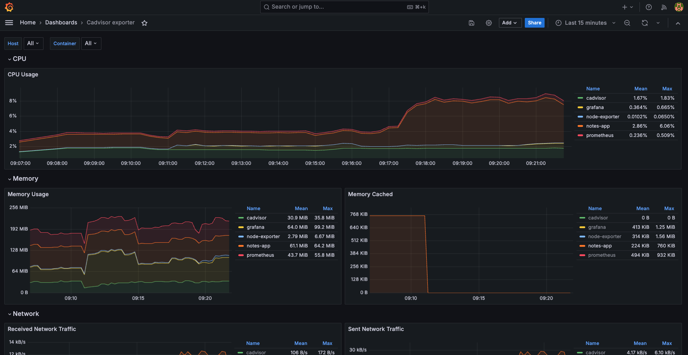
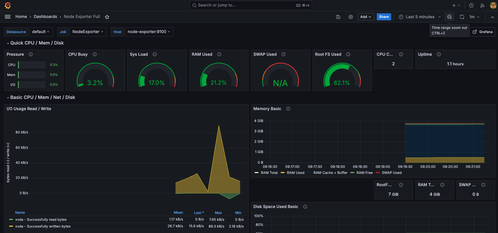

# 🚀 Observability Stack for DevOps (Day 05 – Full Integration Project)

A complete, production-style observability stack covering **metrics, logs, and traces** using Docker Compose.

This project integrates everything built across Day 01–05 into a single system that can be deployed with one command.

---
Metrics, logs, and traces — one `docker compose up` away.




## 📌 Architecture Overview

```
                    METRICS PIPELINE
Node Exporter ─┐
cAdvisor ──────┼──> Prometheus ────> Grafana Dashboards
OTEL Collector ┘         │
                         └── Alert Rules

                    LOGS PIPELINE
Docker → Promtail → Loki → Grafana (Explore + Panels)

                    TRACES PIPELINE
App / curl → OTEL Collector → Debug Output (future: Tempo)
```

---

## 🧰 Tech Stack

* **Prometheus** → Metrics collection (pull-based)
* **Node Exporter** → Host-level metrics (CPU, RAM, Disk)
* **cAdvisor** → Container metrics
* **Grafana** → Visualization + alerting
* **Loki** → Log aggregation (label-based indexing)
* **Promtail** → Log shipping agent
* **OpenTelemetry Collector** → Metrics + traces pipeline
* **Notes App** → Sample workload

---

## ⚡ Quick Start

```bash
cd day-05-observability-project
docker compose up -d
docker compose ps
```

Access:

* Grafana → http://localhost:3000 (admin/admin)
* Prometheus → http://localhost:9090
* cAdvisor → http://localhost:8080
* Notes App → http://localhost:8000

````

---

## ✅ Service Validation

| Service | Port | Check |
|--------|------|------|
| Prometheus | 9090 | `/targets` should be UP |
| Node Exporter | 9100 | `curl localhost:9100/metrics` |
| cAdvisor | 8080 | Web UI |
| Grafana | 3000 | Dashboard loads |
| Loki | 3100 | `/ready` |
| Promtail | 9080 | Internal |
| OTEL Collector | 4317/4318 | `docker logs otel-collector` |
| Notes App | 8000 | UI loads |

---

## 📊 Metrics Validation (PromQL)

Run in Prometheus UI:

```promql
# All targets healthy
up

# CPU usage
100 - (avg(rate(node_cpu_seconds_total{mode="idle"}[5m])) * 100)

# Memory usage %
(1 - node_memory_MemAvailable_bytes / node_memory_MemTotal_bytes) * 100

# Container CPU
rate(container_cpu_usage_seconds_total{name!=""}[5m]) * 100

# Top 3 containers by memory
topk(3, container_memory_usage_bytes{name!=""})
````

---

## 📜 Logs Validation (Loki / LogQL)

Generate logs:

```bash
for i in $(seq 1 50); do curl -s http://localhost:8000 > /dev/null; done
```

Queries in Grafana → Explore:

```logql
{job="docker"}
{container_name="notes-app"}
{job="docker"} |= "error"
{container_name="notes-app"} |= "GET"
sum by (container_name) (rate({job="docker"}[5m]))
```

---

## 🔍 Traces Validation (OTEL)

Send test trace:

```bash
curl -X POST http://localhost:4318/v1/traces \
  -H "Content-Type: application/json" \
  -d '{...}'
```

Check:

```bash
docker logs otel-collector | grep test-span
```

---

## 📈 Dashboard (Production Overview)

Custom dashboard includes:

### System Health

* CPU Usage %
* Memory Usage %
* Disk Usage %
* Targets UP

### Container Metrics

* CPU usage per container
* Memory usage per container
* Running container count

### Logs

* Notes-app logs
* Error rate
* Log volume

### Service Health

* Prometheus scrape latency
* OTEL metrics ingestion

---

## 🔔 Alerting

Prometheus alert rules include:

* High CPU usage (>80%)
* High Memory usage (>75%)
* Disk usage (>90%)
* Container down
* Target down

Grafana alerting used for:

* Container memory spikes
* Notification routing

---

## 🔁 Data Flow Validation

| Pipeline | Flow                               |
| -------- | ---------------------------------- |
| Metrics  | Exporters → Prometheus → Grafana   |
| Logs     | Docker → Promtail → Loki → Grafana |
| Traces   | OTEL → Collector → Debug           |

---

## 📚 Learning Mapping

| Day | Concept                             |
| --- | ----------------------------------- |
| 73  | Prometheus, metrics                 |
| 74  | Node Exporter, cAdvisor, dashboards |
| 75  | Loki, Promtail, logs                |
| 76  | OTEL, traces, alerting              |
| 77  | Full stack integration              |

---

## ⚖️ Comparison with Managed Tools

| Feature     | This Stack | Datadog / CloudWatch |
| ----------- | ---------- | -------------------- |
| Cost        | Free       | Paid                 |
| Setup       | Manual     | Easy                 |
| Flexibility | High       | Medium               |
| Control     | Full       | Limited              |

---

## 🚀 Production Improvements

* Alertmanager integration (Slack, PagerDuty)
* Grafana Tempo for trace storage
* TLS/HTTPS for all services
* Authentication (Grafana + Prometheus)
* Persistent storage (S3/GCS)
* High Availability setup

---

## 🧹 Cleanup

```bash
docker compose down
docker compose down -v
```

---

## 🧠 Key Insight

Monitoring tells you *something is wrong*.
Observability lets you **find why, where, and how fast**.

---

## 👨‍💻 Author

Built as part of a structured DevOps learning path (Day 01–05).

---
